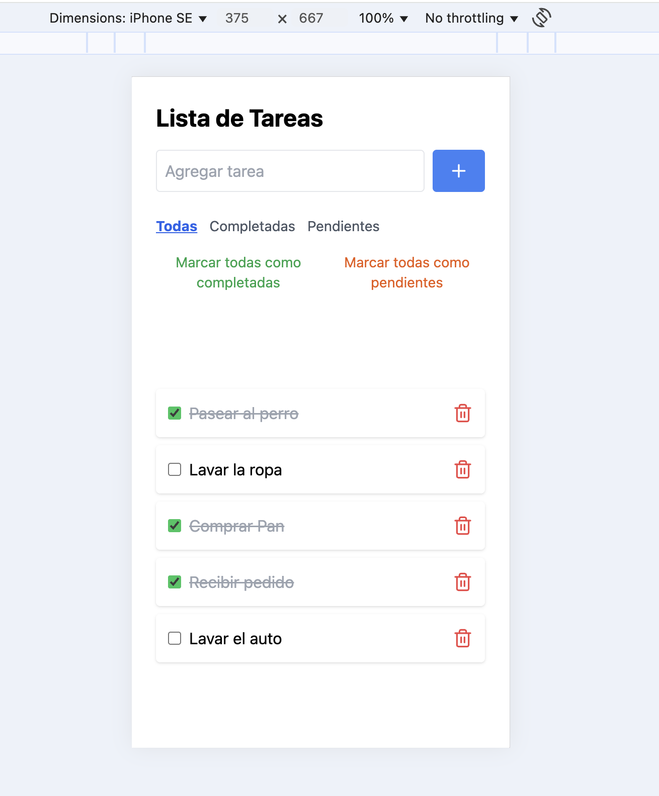

# Módulo 4.3 - Frameworks - Laboratorio Vue

En este proyecto creamos una aplicación web utilizando Vue que permite a los usuarios administrar una lista de tareas en el estado de la aplicación utilizando un store de Pinia.

## Puntos Opcionales agregados
- Estilos CSS utilizando Tailwind.
- Persistencia de estado utilizando un Storage local.
- Botones Add y remove con accesibilidad.
- Funcionalidad de filtrado para Tareas completadas y pendientes.
- Marcado de todas las tareas Completadas y pendientes.

## Instalación

1. **Clonar el repositorio**:
   git clone https://github.com/tgordyn/Modulo-4.3--Frameworks-Vue-Laboratorio.git

2. **Navegar al directorio del repositorio**:
   - cd Modulo-4.3--Frameworks-Vue-Laboratorio

3. **Instalar las dependencias**:
   `npm install`

## Ejecutar aplicación

Para ejecutar la aplicación en "development mode" se utiliza el comando `npm run dev`.
Se abrirá por defecto en el localhost 5173 en el navegador.
